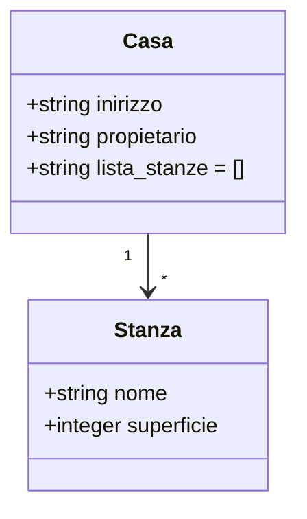

```mermaid
classDiagram
    Casa "1" --> "*" Stanza
    class Casa
    Casa : +string inirizzo
    Casa : +string propietario
    Casa : +string lista_stanze = []
    class Stanza
    Stanza : +string nome
    Stanza : +integer superficie
```