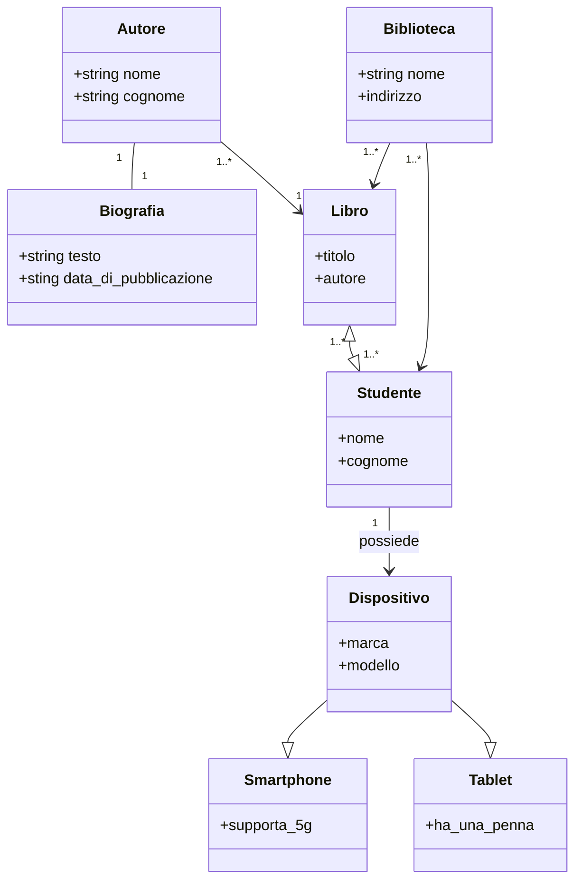

```mermaid

classDiagram
    Autore "1" -- "1" Biografia
    Autore "1..*" --> "1" Libro
    class Autore 
    Autore : +string nome
    Autore : +string cognome
    Biblioteca "1..*" --> Libro
    Biblioteca "1..*" --> Studente
    Libro "1..*" <|--|> "1..*" Studente 
    Studente "1" --> Dispositivo : possiede
    Dispositivo --|> Smartphone
    Dispositivo --|> Tablet

    class Biografia {
    +string testo
    +sting data_di_pubblicazione
    }

    class Biblioteca {
    +string nome
    +indirizzo
    }

    class Libro {
    +titolo
    +autore
    }

    class Studente {
    +nome
    +cognome
    }

    class Dispositivo {
    +marca
    +modello
    }
    class Smartphone {
    +supporta_5g
    }
    class Tablet {
    +ha_una_penna
    }
```