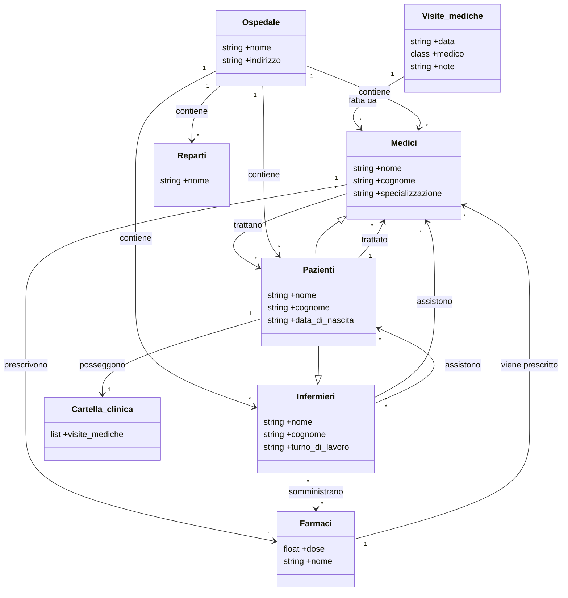

```mermaid
classDiagram

Medici "1" --> "*" Farmaci : prescrivono
Medici "*" --> "*" Pazienti : trattano

Visite_mediche "1" --> "*" Medici : fatta da

Farmaci "1" --> "*" Medici : viene prescritto

Infermieri "*" --> "*" Medici : assistono
Infermieri "*" --> "*" Pazienti : assistono
Infermieri "*" --> "*" Farmaci : somministrano

Ospedale "1" --> "*" Reparti : contiene 
Ospedale "1" --> "*" Infermieri : contiene
Ospedale "1" --> "*" Medici : contiene
Ospedale "1" --> "*" Pazienti : contiene

Pazienti "1" --> "1" Cartella_clinica : posseggono
Pazienti --|> Medici
Pazienti --|> Infermieri
Pazienti "1" --> "*" Medici : trattato

class Ospedale
    Ospedale:string +nome
    Ospedale:string +indirizzo
class Medici
    Medici:string +nome
    Medici:string +cognome
    Medici:string +specializzazione
class Pazienti
    Pazienti:string +nome
    Pazienti:string +cognome
    Pazienti:string +data_di_nascita
class Farmaci
    Farmaci:float +dose
    Farmaci:string +nome
class Reparti
    Reparti:string +nome
class Infermieri
    Infermieri:string +nome
    Infermieri:string +cognome
    Infermieri:string +turno_di_lavoro
class Cartella_clinica
    Cartella_clinica:list +visite_mediche
class Visite_mediche
    Visite_mediche:string +data
    Visite_mediche:class +medico
    Visite_mediche:string +note
```