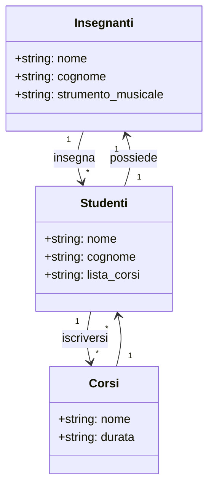

```mermaid
classDiagram
    Insegnanti "1" --> "*" Studenti :insegna
    Studenti "1" --> "1" Insegnanti :possiede
    Studenti "1" --> "*" Corsi :iscriversi
    Corsi "1" --> "*" Studenti
    
    class Insegnanti {
        +string: nome
        +string: cognome
        +string: strumento_musicale
    }
    class Studenti {
        +string: nome
        +string: cognome
        +string: lista_corsi
    }
    class Corsi {
        +string: nome
        +string: durata
    }
```