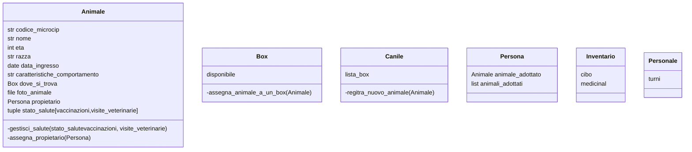

```mermaid
    classDiagram
    class Animale {
    str codice_microcip
    str nome
    int eta
    str razza
    date data_ingresso
    str caratteristiche_comportamento
    Box dove_si_trova
    file foto_animale
    Persona propietario
    tuple stato_salute[vaccinazioni,visite_veterinarie]
    -gestisci_salute(stato_salutevaccinazioni, visite_veterinarie)
    -assegna_propietario(Persona)
    }
    class Box {
    disponibile
    -assegna_animale_a_un_box(Animale)
    }
    class Canile {
    lista_box
    -regitra_nuovo_animale(Animale)
    }
    class Persona {
    Animale animale_adottato
    list animali_adottati
    }
    class Inventario {
    cibo
    medicinal
    }
    class Personale {
    turni
    }
```