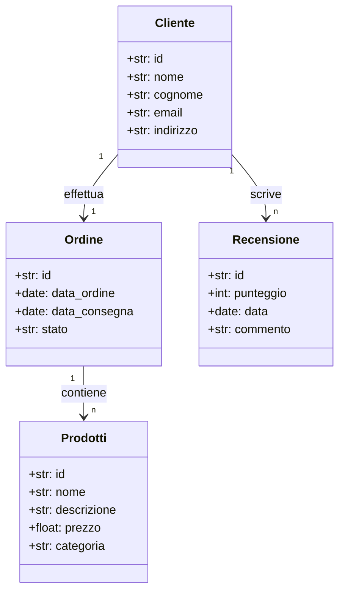

```mermaid
classDiagram
    class Prodotti {
        +str: id
        +str: nome
        +str: descrizione
        +float: prezzo
        +str: categoria
    }

    class Cliente {
        +str: id
        +str: nome
        +str: cognome
        +str: email
        +str: indirizzo
    }
    class Ordine {
        +str: id
        +date: data_ordine
        +date: data_consegna
        +str: stato
    }

    class Recensione {
        +str: id
        +int: punteggio
        +date: data
        +str: commento
    }
    Cliente "1" --> "1" Ordine:effettua
    Ordine "1" --> "n" Prodotti:contiene
    Cliente "1" --> "n" Recensione:scrive
```