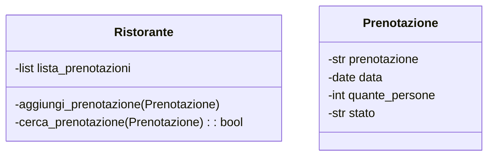

```mermaid
    classDiagram
    class Ristorante {
    -list lista_prenotazioni
    -aggiungi_prenotazione(Prenotazione)
    -cerca_prenotazione(Prenotazione) : bool
    }

    class Prenotazione {
    -str prenotazione
    -date data
    -int quante_persone
    -str stato
    }
```