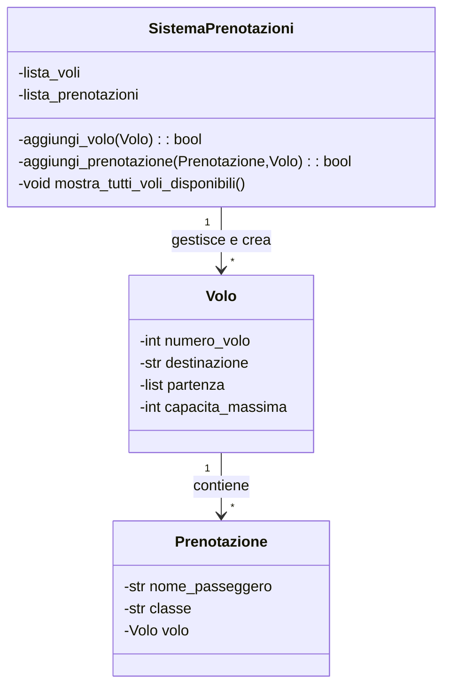

```mermaid
    classDiagram

    class Volo {
    -int numero_volo
    -str destinazione
    -list partenza
    -int capacita_massima
    }

    class Prenotazione {
    -str nome_passeggero
    -str classe
    -Volo volo
    }

    class SistemaPrenotazioni {
    -lista_voli
    -lista_prenotazioni
    -aggiungi_volo(Volo) : bool
    -aggiungi_prenotazione(Prenotazione,Volo) : bool
    -void mostra_tutti_voli_disponibili()
    }

    Volo "1" --> "*" Prenotazione :contiene
    SistemaPrenotazioni "1" --> "*" Volo :gestisce e crea
```