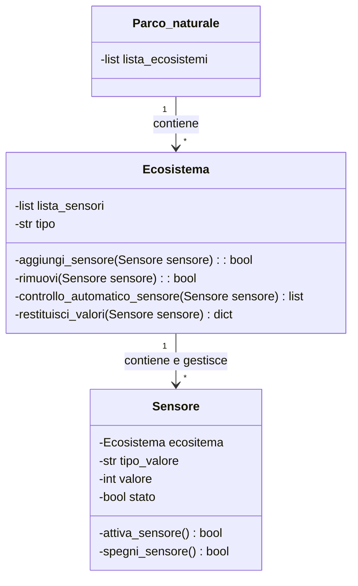

```mermaid
    classDiagram

    Ecosistema "1" --> "*" Sensore : contiene e gestisce
    Parco_naturale "1" --> "*" Ecosistema : contiene

    class Parco_naturale {
    -list lista_ecosistemi
    }
    
    class Ecosistema {
    -list lista_sensori
    -str tipo
    -aggiungi_sensore(Sensore sensore): bool
    -rimuovi(Sensore sensore): bool
    -controllo_automatico_sensore(Sensore sensore) list
    -restituisci_valori(Sensore sensore) dict
    }

    class Sensore {
    -Ecosistema ecositema
    -str tipo_valore
    -int valore
    -bool stato
    -attiva_sensore() bool
    -spegni_sensore() bool
    }


```