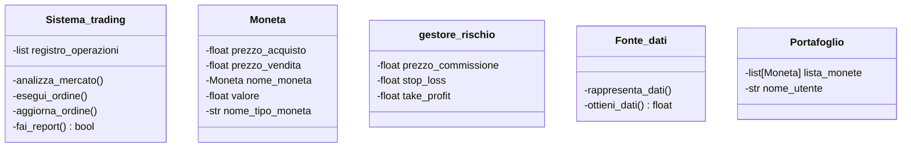

```mermaid
    classDiagram

    class Sistema_trading {
    -analizza_mercato()
    -esegui_ordine()
    -aggiorna_ordine()
    -list registro_operazioni
    -fai_report() bool 
    }
    class Moneta {
    -float prezzo_acquisto
    -float prezzo_vendita
    -Moneta nome_moneta
    -float valore
    -str nome_tipo_moneta
    }
    class gestore_rischio {
    -float prezzo_commissione
    -float stop_loss
    -float take_profit
    }
    class Fonte_dati {
    -rappresenta_dati()
    -ottieni_dati() float
    }
    class Portafoglio {
    -list[Moneta] lista_monete
    -str nome_utente
    }
    
```