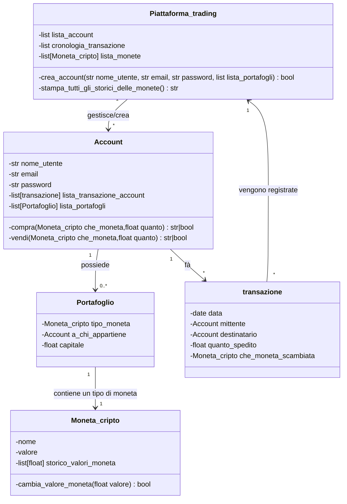

```mermaid
    classDiagram
    Piattaforma_trading "1" --> "*" Account : gestisce/crea
    Account "1"--> "0..*" Portafoglio : possiede
    Portafoglio "1" --> "1" Moneta_cripto : contiene un tipo di moneta
    Account "1" --> "*" transazione : fà
    transazione "*"--> "1" Piattaforma_trading : vengono registrate
    

    class Piattaforma_trading {
        -list lista_account
        -list cronologia_transazione
        -list[Moneta_cripto] lista_monete
        -crea_account(str nome_utente, str email, str password, list lista_portafogli) bool
        -stampa_tutti_gli_storici_delle_monete() str
    }
    class transazione {
        -date data
        -Account mittente
        -Account destinatario
        -float quanto_spedito
        -Moneta_cripto che_moneta_scambiata
    }
    class Account {
        -str nome_utente
        -str email
        -str password
        -list[transazione] lista_transazione_account
        -compra(Moneta_cripto che_moneta,float quanto) str|bool
        -vendi(Moneta_cripto che_moneta,float quanto) str|bool
        -list[Portafoglio] lista_portafogli
    }
    class Portafoglio {
        -Moneta_cripto tipo_moneta
        -Account a_chi_appartiene
        -float capitale
    }
    class Moneta_cripto {
        -nome
        -valore
        -list[float] storico_valori_moneta
        -cambia_valore_moneta(float valore) bool
}
```