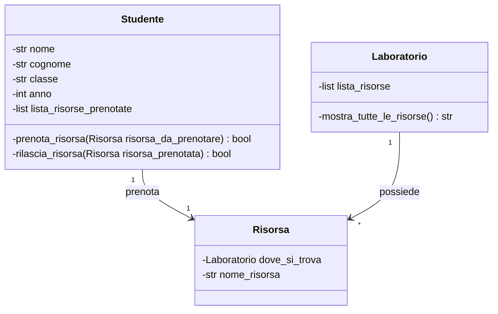

```mermaid
    classDiagram

    class Laboratorio {
        -list lista_risorse
        -mostra_tutte_le_risorse() str
    }

    class Risorsa {
        -Laboratorio dove_si_trova
        -str nome_risorsa
    }

    class Studente {
        -str nome
        -str cognome
        -str classe
        -int anno
        -list lista_risorse_prenotate
        -prenota_risorsa(Risorsa risorsa_da_prenotare) bool
        -rilascia_risorsa(Risorsa risorsa_prenotata) bool
    }

    Studente "1" --> "1" Risorsa : prenota
    Laboratorio "1" --> "*" Risorsa : possiede
```