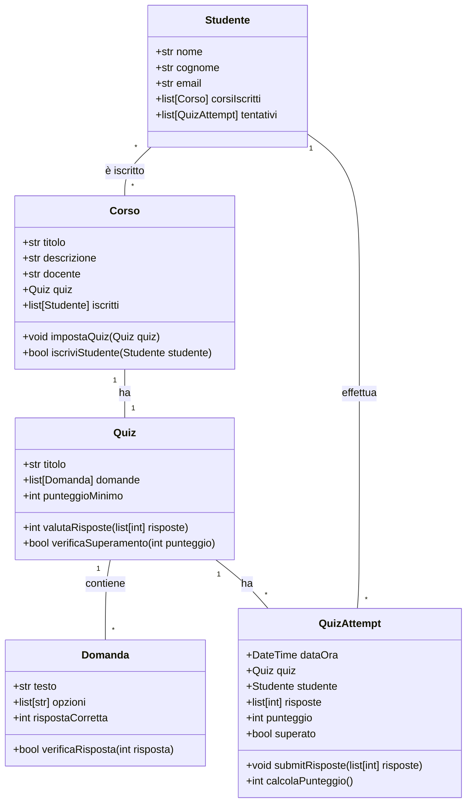

```mermaid
classDiagram

    Corso "1" -- "1" Quiz : ha
    Studente "*" -- "*" Corso : è iscritto
    Quiz "1" -- "*" Domanda : contiene
    Quiz "1" -- "*" QuizAttempt : ha
    Studente "1" -- "*" QuizAttempt : effettua

    class Corso {
        +str titolo
        +str descrizione
        +str docente
        +Quiz quiz
        +list[Studente] iscritti
        +void impostaQuiz(Quiz quiz)
        +bool iscriviStudente(Studente studente)
    }

    class Studente {
        +str nome
        +str cognome
        +str email
        +list[Corso] corsiIscritti
        +list[QuizAttempt] tentativi
    }

    class Quiz {
        +str titolo
        +list[Domanda] domande
        +int punteggioMinimo
        +int valutaRisposte(list[int] risposte)
        +bool verificaSuperamento(int punteggio)
    }

    class Domanda {
        +str testo
        +list[str] opzioni
        +int rispostaCorretta
        +bool verificaRisposta(int risposta)
    }

    class QuizAttempt {
        +DateTime dataOra
        +Quiz quiz
        +Studente studente
        +list[int] risposte
        +int punteggio
        +bool superato
        +void submitRisposte(list[int] risposte)
        +int calcolaPunteggio()
    }
```
