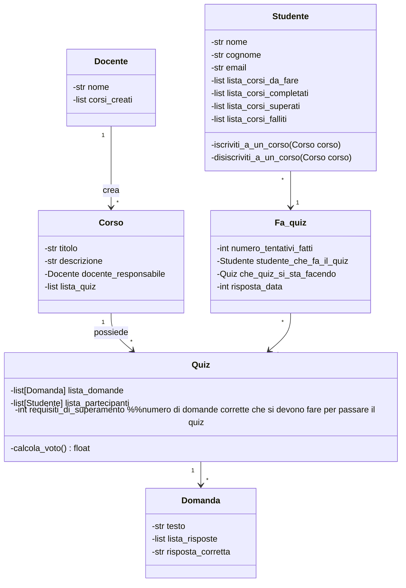

```mermaid
    classDiagram

    class Corso {
        -str titolo
        -str descrizione
        -Docente docente_responsabile
        -list lista_quiz
    }

    class Quiz {
        -list[Domanda] lista_domande
        -list[Studente] lista_partecipanti
        -int requisiti_di_superamento %%numero di domande corrette che si devono fare per passare il quiz
        -calcola_voto() float
    }

    class Domanda {
        -str testo
        -list lista_risposte
        -str risposta_corretta
    }

    class Studente {
        -str nome
        -str cognome
        -str email
        -list lista_corsi_da_fare
        -list lista_corsi_completati
        -list lista_corsi_superati
        -list lista_corsi_falliti
        -iscriviti_a_un_corso(Corso corso)
        -disiscriviti_a_un_corso(Corso corso)
    }

    class Fa_quiz {
        -int numero_tentativi_fatti
        -Studente studente_che_fa_il_quiz
        -Quiz che_quiz_si_sta_facendo
        -int risposta_data
    }

    class Docente {
        -str nome
        -list corsi_creati
    }

    Corso "1" --> "*" Quiz : possiede
    Docente "1" --> "*" Corso : crea
    Studente "*" --> "1" Fa_quiz
    Fa_quiz "*" --> "1" Quiz
    Quiz "1" --> "*" Domanda

```