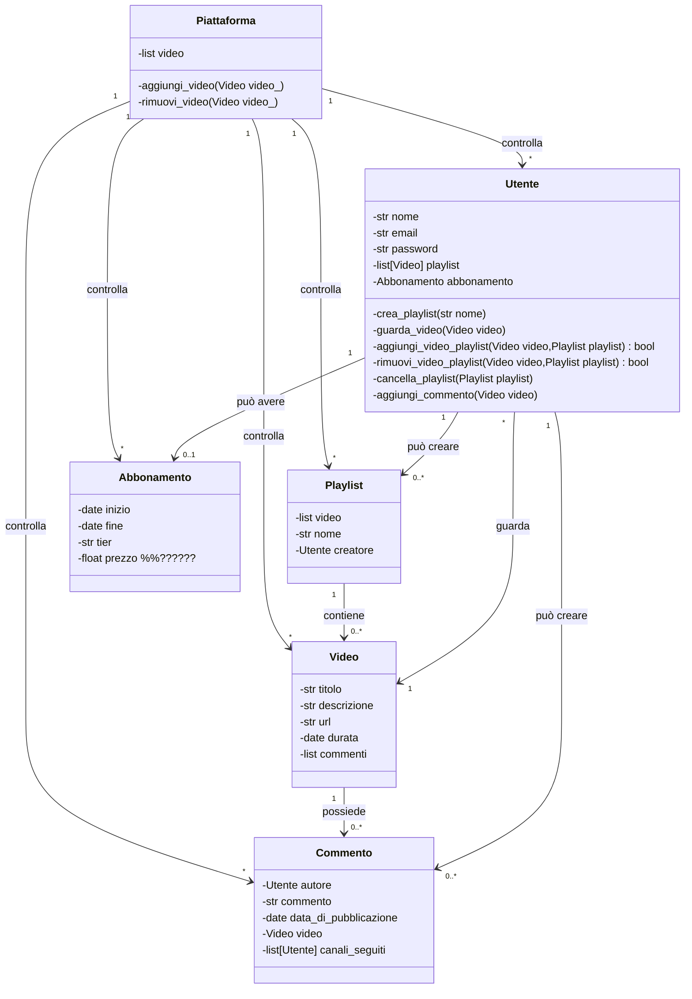

```mermaid
    classDiagram
    Piattaforma "1" --> "*" Video : controlla
    Piattaforma "1" --> "*" Playlist : controlla
    Piattaforma "1" --> "*" Utente : controlla
    Piattaforma "1" --> "*" Commento : controlla
    Piattaforma "1" --> "*" Abbonamento : controlla

    Playlist "1" --> "0..*" Video : contiene
    Video "1" --> "0..*" Commento : possiede
    Utente "*" --> "1" Video : guarda
    Utente "1" --> "0..*" Playlist : può creare
    Utente "1" --> "0..1" Abbonamento : può avere
    Utente "1" --> "0..*" Commento : può creare

    class Video {
        -str titolo
        -str descrizione
        -str url
        -date durata
        -list commenti
    }
    class Playlist {
        -list video
        -str nome
        -Utente creatore
    }
    class Utente {
        -str nome
        -str email
        -str password
        -list[Video] playlist
        -Abbonamento abbonamento
        -crea_playlist(str nome)
        -guarda_video(Video video)
        -aggiungi_video_playlist(Video video,Playlist playlist) bool
        -rimuovi_video_playlist(Video video,Playlist playlist) bool
        -cancella_playlist(Playlist playlist)
        -aggiungi_commento(Video video)
    }
    class Commento {
        -Utente autore
        -str commento
        -date data_di_pubblicazione
        -Video video
        -list[Utente] canali_seguiti
    }
    class Piattaforma {
        -list video
        -aggiungi_video(Video video_)
        -rimuovi_video(Video video_)
    }
    class Abbonamento {
        -date inizio
        -date fine
        -str tier
        -float prezzo %%??????
    }
```